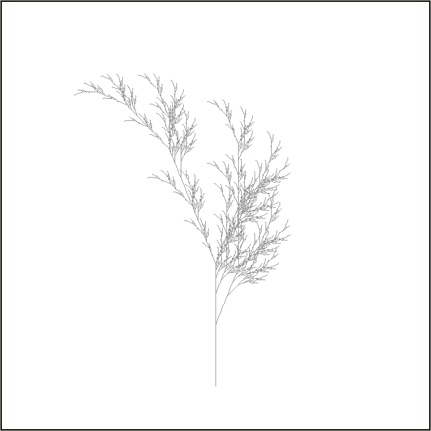
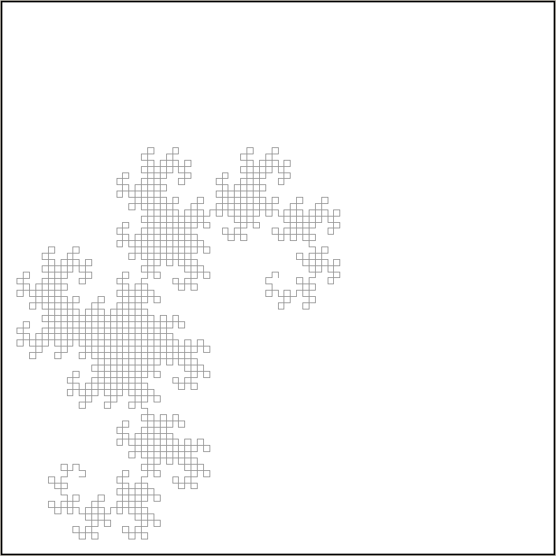
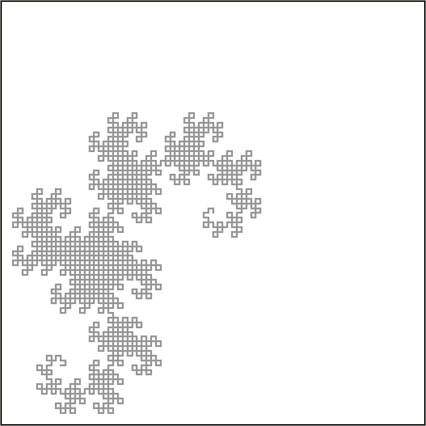
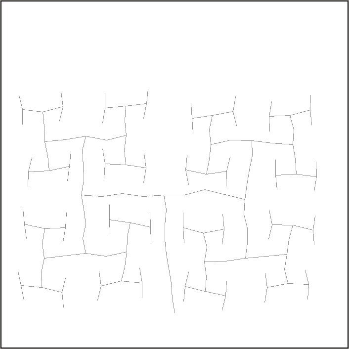
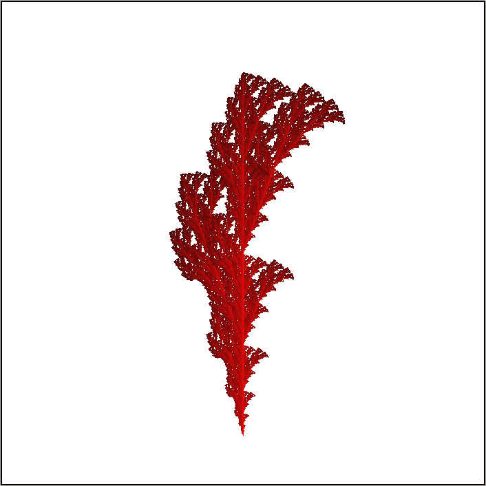
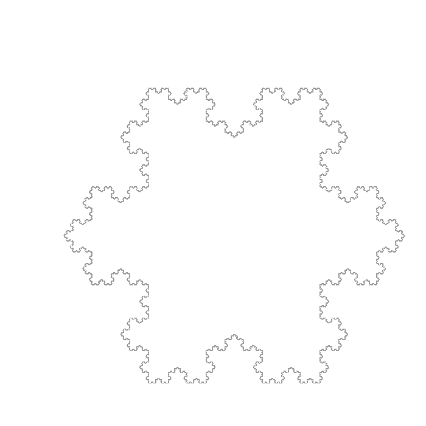

# Rapport

## Sommaire

* [Identifiants](#identifiants)
* [Fonctionnalités](#fonctionnalités)
  * [Fonctionnalités implémentées](#fonctionnalités-implémentées)
  * [Fonctionnalités manquantes](#fonctionnalités-manquantes)
* [Compilation et exécution](#compilation-et-exécution)
  * [Compilation](#compilation)
    * [Prérequis à installer](#prérequis-à-installer)
    * [Docker](#docker)
      * [Comment l'utiliser](#comment-lutiliser)
    * [`Make`](#make)
  * [Exécution](#exécution)
    * [Usage](#usage)
      * [`--help`](#--help)
    * [Options](#options)
      * [`-f`](#-f)
      * [`-s`](#-s)
      * [`-o`](#-o)
      * [`--line-width`](#--line-width)
      * [`--color`](#--color)
      * [`--start-pos`](#--start-pos)
      * [`--verbose`](#--verbose)
    * [_Keymap_](#keymap)
  * [Les fichiers _.sys_](#les-fichiers-_sys)
    * [Exemple de fichier valide](#exemple-de-fichier-valide)
  * [Exemples](#exemples)
    * [Interprétation monochrome](#interprétation-monochrome)
    * [`--start-pos=center`](#--start-poscenter)
    * [`--line-width=3`](#--line-width3)
    * [`-s 15`](#-s-15)
    * [Dégradé rouge](#dégradé-rouge)
    * [Sauvegarde d'image](#sauvegarde-dimage)
* [Découpage modulaire](#découpage-modulaire)
  * [`Lsystems`](#lsystems)
  * [`Limage`](#limage)
  * [`Main`](#main)
  * [Test unitaires](#test-unitaires)
* [Organisation du travail](#organisation-du-travail)
  * [Méthode *Scrum*](#méthode-scrum)
  * [Répartition des tâches](#répartition-des-tâches)
    * [Au début du projet](#au-début-du-projet)
    * [Au milieu](#au-milieu)
    * [A la fin](#a-la-fin)
* [Remarque](#remarque)

## Identifiants

| Nom      | Prénom | GitLab ID                                                                     | Numéro étudiant |
|----------|--------|-------------------------------------------------------------------------------|-----------------|
| Rolley   | Emile  | [@EmileRolley](https://gaufre.informatique.univ-paris-diderot.fr/EmileRolley) | 71802612        |
| Phol Asa | Rémy   | [@pholasa](https://gaufre.informatique.univ-paris-diderot.fr/pholasa)         | 71803190        |

## Fonctionnalités

### Fonctionnalités implémentées

Le programme permet de :

* dessiner étape par étape un L-Système en appuyant sur une touche (`a | l | j`)
* revoir le dessin précédent du L-Système en appuyant sur une touche (`p | h | k`)
* charger un L-Système depuis un fichier `sys` (`-f`)
* redimensionner l'échelle pour garder le dessin à l'intérieur de la fenêtre
* choisir la position de départ de la `tortue` (`--start-pos`)
* afficher le dessin avec un dégradé de couleur (`--color`)
* afficher le dessin avec une épaisseur de trait différentes (`--line-width`)
* ajouter une variation sur la valeur des angles lors de l'interprétation (`-s`)
* de sauvegarder le contenu de la fenêtre en une image `PNG` couleur (`-o`)

### Fonctionnalités manquantes

Nous n'avons pas implémenté la partie `2.4` du sujet permettant d'optimiser la
complexité en espace de notre programme. Ne l'ayant implémentée dès le départ
nous avons préférez nous concentré sur l'implémentation des autres extensions.

De plus le redimensionnement ainsi que le calcul du dégradé sont des approximations
et non des calculs exacts.

## Compilation et exécution

### Compilation

#### Prérequis à installer

Voir [INSTALL.md](../INSTALL.md)

* [OCaml](https://ocaml.org)
* [dune](https://github.com/ocaml/dune) et
[Make](https://www.gnu.org/software/make/) pour la compilation.
* Librairies :
  * [Graphics](https://github.com/ocaml/graphics) pour la `GUI`.
  * [OUnit2](https://github.com/gildor478/ounit) pour les tests unitaires (`opam install ounit2`).
  * [bimage](https://github.com/zshipko/ocaml-bimage) et [bimage-unix](https://opam.ocaml.org/packages/bimage-unix/)
pour la sauvegarde des images (`opam install bimage bimage-unix`).

#### Docker

Pour ne pas avoir à installer toutes les dépendances il est possible d'utiliser
l'image `Docker` :

  [emilerolley/opam2-dune](https://hub.docker.com/r/emilerolley/opam2-dune)

##### Comment l'utiliser

Pour récupérer l'image, utiliser :

```shell
> docker pull emilerolley/opam2-dune:latest
```

Pour pouvoir lancer un conteneur et être capable d'ouvrir la fenêtre `Graphics`,
utiliser :

```shell
> docker run --rm -ti --net=host -e DISPLAY emilerolley/opam2-dune
```

#### `Make`

Liste des commandes `Make` disponible :

* `make` compile l'exécutable *./_build/default/main/main.exe* après avoir
compilé et exécuté les tests unitaires.

* `make test` compile et exécute les tests unitaires.

* `make clean` efface le répertoire provisoire `_build`
    produit par `dune` lors de ses compilations.

### Exécution

Pour lancer l'exécutable, `./run arg1 arg2 ...`.

#### Usage

##### `--help`

L'option `--help`, permet d'afficher la page d'aide.

```shell
>./run --help
Usage:
                ./run.sh -f sys_file [ options ]

Needed:
  -f            Input file where the L-System is described

Options:
  -s            Value for the aleatory shifting in the interpretation
  -o            The output file where final image will be saved to
  --line-width  Positive integer used for initialized the line width
  --color       Rendering color accepted values :
                     red, blue, green, magenta, cyan, yellow, (default: grey)

  --start-pos   The starting position accepted values :
                     center, bottom, top, center-left, center-right, bottom-left,
                     bottom-right, top-left, top-right (default: bottom)

  -help        Display this list of options
  --help       Display this list of options
```

#### Options

##### `-f`

L'option `-f` est nécessaire et permet de spécifier le fichier *.sys* décrivant
le L-Système voulant être visualisé (voir la section [Les fichiers _.sys_](#les-fichiers-.sys)
pour plus de détails).

##### `-s`

L'option `-s` permet de définir un **entier positif** qui corresponds à la
variation potentielle de l'interprétation de la valeur des angles.
Plus la valeur est grande plus la variation sera grande.

##### `-o`

L'option `-o` permet de préciser le chemin vers le fichier dans lequel pourra être
sauvegardée la représentation.

> Format disponible : `PNG`.

##### `--line-width`

L'option `--line-width` permet de définir l'épaisseur du trait (la valeur doit
être un entier positif).

> Par défaut, `--line-width=1`.

##### `--color`

L'option `--color` permet de visualiser le L-Système avec un dégradé monochrome.

Liste des couleurs disponibles :

* rouge (*red*)
* bleu  (*blue*)
* vert  (*green*)
* jaune (*yellow*)
* magenta (*magenta*)
* bleu ciel (*cyan*)

> Si l'option n'est pas précisée la couleur utilisée sera grise.

##### `--start-pos`

L'option `--start-pos` permet de définir la position de départ de l'interprétation.

> Par défaut, `--start-pos=bottom`.

##### `--verbose`

L'option `--verbose` permet d'afficher des informations supplémentaires lors
de l'exécution du programme.
Elle principalement utilisée pour le _debuggage_.

Exemple de messages :

```shell
> ./run -f examples/snow.sys -o img/snow.png --verbose
[INFO] - Color       = 'false'
[INFO] - Shifting    = '0.000000'
[INFO] - Src file    = 'examples/snow.sys'
[INFO] - Dest file   = 'img/snow.png'
[INFO] - L-System created
[INFO] - n = 1, current_word = 'A++A++A'
[INFO] - n = 2, current_word = 'A-A++A-A++A-A++A-A++A-A++A-A'
[INFO] - n = 3, current_word = 'A-A++A-A-A-A++A-A++A-A++A-A-A-A++A-A++A-A++A-A-A-A++A-A+
+A-A++A-A-A-A++A-A++A-A++A-A-A-A++A-A++A-A++A-A-A-A++A-A'
```

#### _Keymap_

Lorsque l'interprétation est lancée, il est possible de :

* visualiser l'itération suivante avec `a | l | j`
* visualiser l'itération précédant avec `p | h | k`
* sauvegarder l'interprétation courante avec `s`
(possible uniquement si l'option [`-o`](#-o) est précisée).

> La fenêtre de visualisation peut être fermée à tout moment, simplement, en appuyant
> sur n'importe quelle touche autre que `a l j p h k s`.

### Les fichiers _.sys_

Un fichier _SYS_ est divisé en trois parties, chacunes séparées par une ligne
vide.

Voici quelques contraintes :

* Les lignes commençant par `#` sont ignorées.
* Une règle de réécriture est de la forme : `<Symbole> <Mot>`
* Une interprétation est de la forme : `<Symbole> <Commande>[ <Commande>]`

> **Remarque** : Si une un symbole possède plusieurs règles de réécriture ou
> d'interprétations ce sera la dernière qui sera utilisée.

#### Exemple de fichier valide

```markdown
# Axiome
A+B

# Regles de réécriture
A BB
B A

# Interprétation
A L30 T60
+ T60
- T-60
```

> Le répertoire _./examples_ contient plusieurs exemples de fichiers système.

### Exemples

#### Interprétation monochrome

```shell
> ./run -f examples/br5.sys
```



#### `--start-pos=center`

```shell
> ./run -f examples/dragon.sys --start-pos=center
```



#### `--line-width=3`

```shell
> ./run -f examples/dragon.sys --start-pos=center --line-width=3
```



#### `-s 15`

```shell
> ./run -f examples/htree.sys -s 15
```



#### Dégradé rouge

```shell
> ./run -f examples/br2.sys --color=red
```



#### Sauvegarde d'image

```shell
> ./run -f examples/snow.sys -o img/snow.png --start-pos=bottom-right
[INFO] - Saving PNG image at 'img/snow.png' the iteration 6
```



## Découpage modulaire

### `Lsystems`

La bibliothèque `lsystems` contient les modules se rapportant à la gestion
des L-Systèmes.

* `Lsystems.Systems` Ce module permet de gérer tous les calculs fait sur les
L-Systèmes en particulier : initialisation de L-Système à partir d'un fichier `sys`, et
calcul des itérations du L-Système.
* `Lsystems.Turtle` Ce module à pour but de gérer l'interprétation graphique
d'un L-Système en ajoutant éventuellement de la couleur ou alors des variations
aléatoires au dessin.

### `Limage`

La bibliothèque `limage` contient les modules permettant de sauvegarder l'interprétation
d'un L-Système dans une image.

* `Limage.Png` Ce module a pour but de transformer et sauvegarder
l'interprétation graphique du L-Système en une image `PNG`.
Pour cela, elle utilise les bibliothèques externe `bimage` et `bimage-unix`.

### `Main`

Le point d'entré du programme se trouve dans le fichier `main/main.ml` et fait le lien
entre les différentes bibliothèques.

### Test unitaires

Nous avons voulu suivre la méthode de `TDD`, du moins pour l'implémentation du module
`Lsystems.Systems`.
Ces tests sont contenus dans le fichier `test/test_systems.ml`.
Pour l'implémentation des tests nous avons utilisé la bibliothèque `OUnit2`.

> Nous nous sommes limité à tester de façons *automatique* le module `Lsystems.Systems`,
> en effet, les autres modules ne sont pas *simple* à automatiser en raison de l'utilisation
> d'interface graphique notamment et facile à tester à *la main*.
> De plus, le projet ne portant pas sur les tests unitaires nous avons préférez ne pas
> perdre trop de temps dessus.

## Organisation du travail

### Méthode *Scrum*

Nous avons voulu utiliser une version simplifiée de la méthode *Scrum* vu en L2
pour nous organiser.
Concrètement cela consiste en :

* Des *sprints* d'une durée d'une semaine.
* Une réunion à la fin de chaque *sprint* sur `Discord` durant laquelle nous
faisons le point sur les *issues* implémentées par chacun durant le dernier
*sprint* puis sur celles qui restent à faire avant de s'assigner nos *issues*
pour le prochain *sprint* en fonction de leurs priorités.
* Chaque *issue* corresponds à une fonctionnalité ou à un *patch* et est implémentée
dans sa propre branche avant d'être *merge* dans la branche *develop*, si et seulement si,
la *pipeline* est passée et que toutes les conversations de la *MR* correspondantes sont
closes.
* Lorsque l'état du programme dans la branche *develop* nous parait satisfaisant,
la branche *master* est mise à jour avec *develop* et une nouvelle *release* est crée.

### Répartition des tâches

#### Au début du projet

Rémy :

* Implémentation du calcul des itérations du L-Système.
* Implémentation de la version basique de la Tortue.

Emile :

* Mise en place du `GitLab-CI` ainsi les tests unitaires du projet.
* Division du projet en plusieurs bibliothèques.
* Implémentation du *parsing* des fichiers `.sys`.
* Implémentation de redimensionnement une interprétations de L-Système.
* Implémentation de la première version du main avec la gestion des options

#### Au milieu

Rémy :

* Implémentation des variations aléatoires dans l'interprétation des valeurs des angles.
* Ajouts de la possibilité d'avancer ou revenir en arrière dans les itérations.

Emile :

* Sauvegarde de l'interprétation courante en une image `PNG` en noir et blanc.
* Implémentation de la première version de l'option `--color`.
* Rédaction de la documentation.

#### A la fin

Rémy :

* Ajouts de plusieurs couleurs possibles.
* Modification certaines fonctions en un style récursif.

Emile :

* Suppression des blocs de codes en style itératif.
* Ajouts de la sauvegarde des interprétations en couleurs.

### Remarque

On s'est rendu compte trop tard que l'on avait utilisé des références inutiles
(spécialement dans `Lsystems.Turtle`). Malheureusement, nous n'avons pas eu le
temps de toutes les supprimer.
Une façon *simple* de les supprimer aurait été d'ajouter dans les fonctions utilisant
ces références, un nouvel argument *correspondant* à cette référence puis
renvoyer la nouvelle valeur si la fonction en question la modifie.
Mais en réalité, cette méthode alourdie considérablement le code.
Il aurait donc fallu revoir l'architecture de notre projet pour que ce soit utile.
